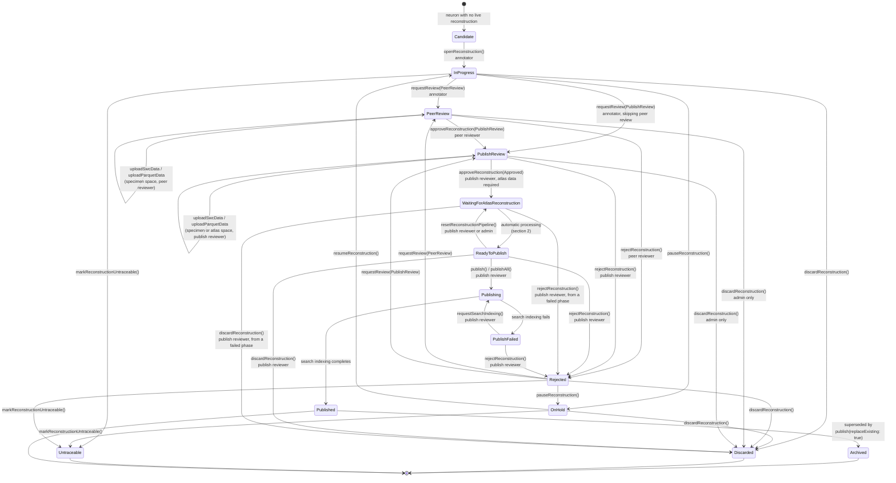
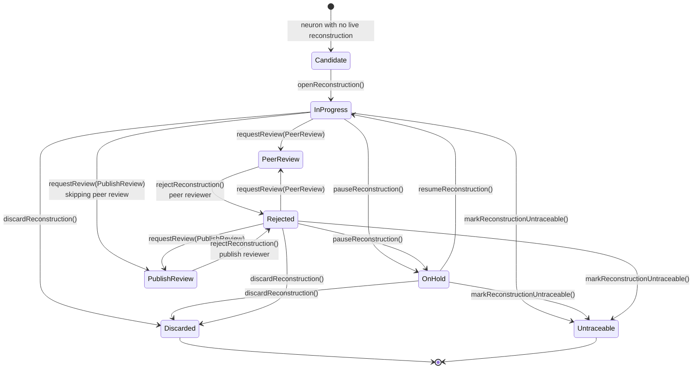
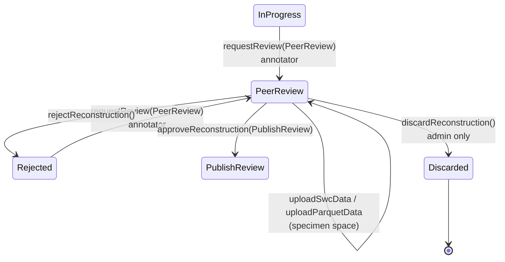
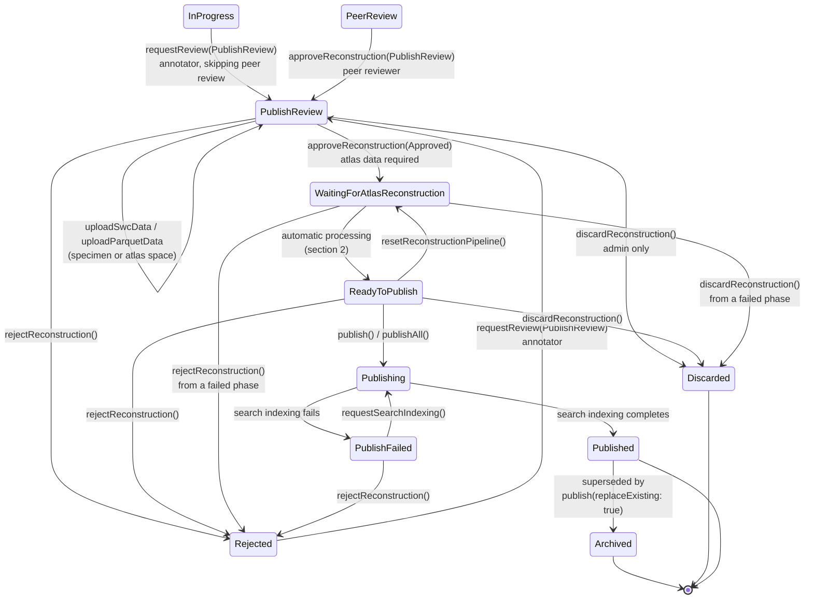
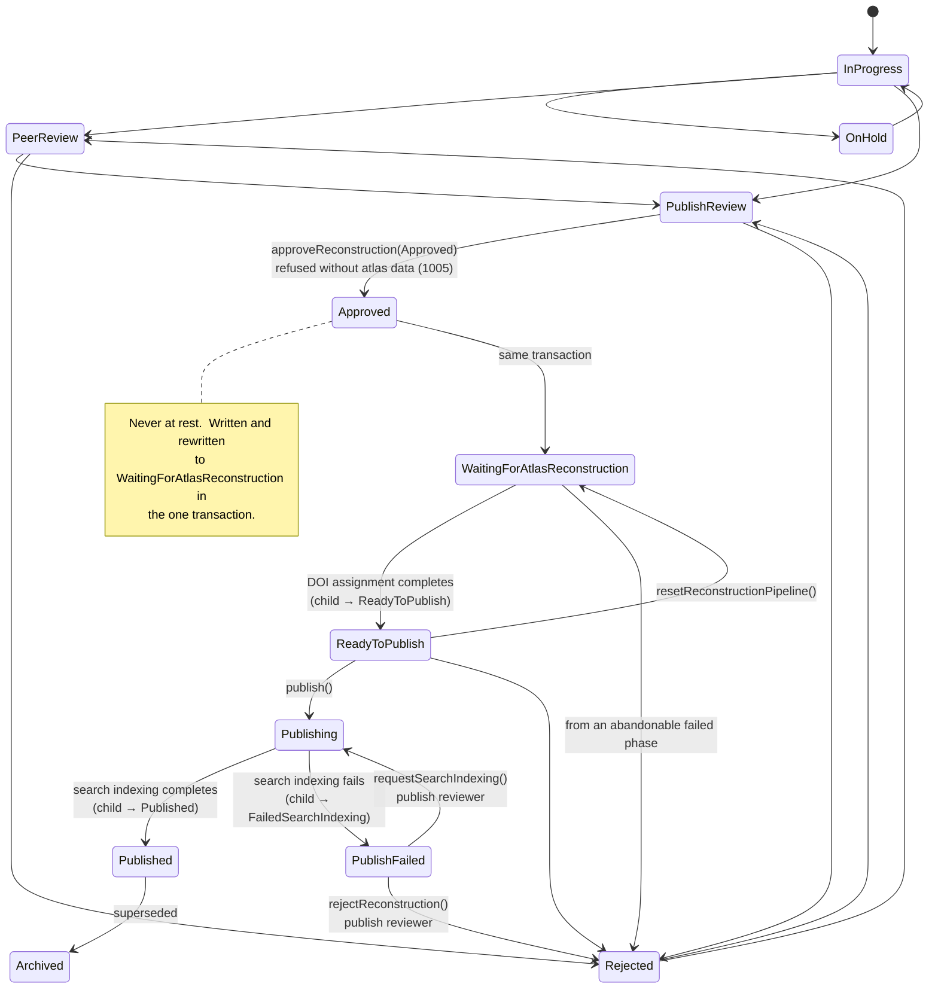
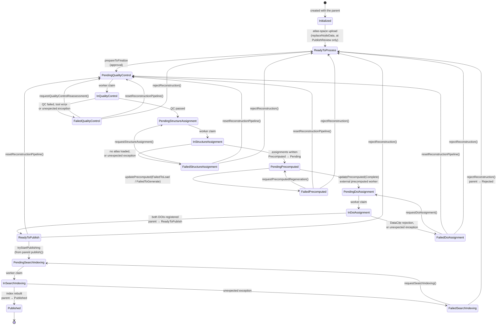
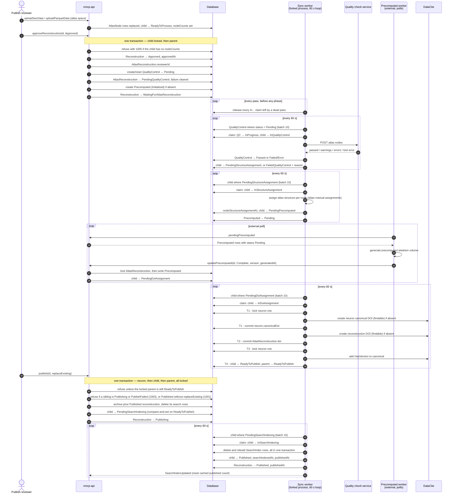

# Reconstruction Publish Workflow

_Updated: 2026-09-16_

How a neuron reconstruction travels from a candidate neuron an annotator picks up, through review, through the
automatic processing phases, to a published record in the search index — and what happens to the reconstruction it
supersedes.

## Vocabulary

Two rows track one piece of work, and each has its own status enum.

| Entity | Table | Status enum | Holds |
|---|---|---|---|
| `Reconstruction` | `Reconstructions` | `ReconstructionStatus` | Specimen-space nodes; the workflow state the user sees |
| `AtlasReconstruction` | `AtlasReconstructions` | `AtlasReconstructionStatus` | Atlas-space (registered) nodes; the processing-pipeline state |

An `AtlasReconstruction` is created at the same moment as its parent `Reconstruction`
(`Reconstruction.openReconstruction`, `src/models/reconstruction.ts:576`) and stays 1:1 with it for life. The parent's
status is the coarse, user-facing state; the child's status is the fine-grained pipeline state. The parent learns
about the child through `onAtlasReconstructionStatusChanged` (`src/models/reconstruction.ts:513`), which handles
exactly two transitions — `ReadyToPublish` and `Published`.

The child also carries `failureReason` and `failedAt` (added by `../src/migrations/20260909000000-phase-failure-columns.ts`).
Every automatic phase writes them when it fails, and every path that rewinds a phase clears them. The parent's
`PublishFailed` arrived with `../src/migrations/20260915000000-publish-failed-status.ts`, which also moves any row already
stranded at `Publishing` under a child at `FailedSearchIndexing`.

Two subsets of the child's statuses carry workflow rules:

- `PhaseFailureStatuses` (`src/models/atlasReconstructionStatus.ts:60`) — the five `Failed…` values, and what the
  derived `phaseFailure` field reports on.
- `AbandonableFailureStatuses` (`:72`) — the same set minus `FailedSearchIndexing`. These are the failed phases a
  reconstruction may be discarded or replayed from, and the ones reject accepts under a
  `WaitingForAtlasReconstruction` parent. Reject has one source outside the set: a `PublishFailed` parent whose child
  is at `FailedSearchIndexing` (1.6).

Supporting rows: `QualityControl` and `Precomputed` hang off the `AtlasReconstruction`; `SpecimenSpacePrecomputed`
hangs off the `Reconstruction` and is not part of the publish path.

### Actors

| Actor | Permission bit | Can do |
|---|---|---|
| Annotator | `AnnotateOne` / `AnnotateMany` | Open a reconstruction, pause/resume, request peer or publish review, discard, mark untraceable |
| Peer reviewer | `PeerReview` | Approve peer review, reject, upload specimen-space data, mark untraceable |
| Publish reviewer | `PublishReview` | Approve publish review, upload specimen- or atlas-space data, reject, discard past approval, publish, retry a failed phase, replay the pipeline |
| Admin | `Admin` | Everything above, plus the discard and reject routes reserved to admins, and the retries and the replay |
| Internal services | `InternalAccess` | Report precomputed generation results; read export data. **No admin bypass** (`src/models/user.ts:498`) |
| Synchronization worker | runs as `User.SystemInternalUser` | Quality control, structure assignment, DOI assignment, search indexing |
| Import tools | none — `disregardAuth` buys out of the permission only | SmartSheet and MouseLight reconciliation, not reachable over GraphQL; held to the same source-status lists as the portal (1.2, 1.4) |

An API key is a credential rather than an actor: it authenticates as its owning user carrying **the key's own**
permissions, which are a subset of the ordinary-user set and never include `Admin` (section 3).

Two permission predicates are worth separating, because they look interchangeable and are not:

- `canModifyReconstruction()` (`src/models/user.ts:375`) is `PublishReview`-only with **no admin bypass**, and gates
  exactly one thing: `updateMetadata`.
- `canOperateReconstructionPipeline()` (`:385`) is admin **or** `PublishReview`, and gates every supervisory pipeline
  action — the five per-phase retries and the replay alike. An admin holding no review bit has these, so the replay is
  never more available than the single retry it subsumes.

### What "Published" Means

**Published, in this system, means present in the main search index — and nothing else.** That is the only thing
`publish` decides, and `publish(replaceExisting: true)` is the only thing that decides which of a neuron's versions
the index returns.

Everything upstream of that exists and is deliberately reachable the moment it is created, whatever the parent's
status: the atlas nodes, the precomputed volume, both DOIs, and the `/neuron/<id>` and
`/neuron/<id>/<reconstruction-id>` pages they resolve to. A reconstruction that reaches `ReadyToPublish` has been
through DOI assignment and is citable from that point on. One that is `Archived` stays citable, which is why 1.5
retains its nodes, DOI and precomputed volume. A neuron whose reconstruction never reaches the index still carries a
canonical DOI resolving to its own page.

None of that is leakage or a loose end. The neuron page, with its reconstruction sub-variants, has value
independently of what the portal's front-page search returns, and the DOIs identify those pages rather than the
index entry. The consequence for section 4 is worth stating once: **a DOI resolving to something that is not in the
search index is never a finding in this document.** The only DOI question that is one is a DOI resolving to nothing
at all.

---

## 1. The user-facing workflow

This is what an annotator, a reviewer and a publisher actually do. The automatic phases are collapsed into
`WaitingForAtlasReconstruction` here; section 2 opens it up. That status appears in this diagram rather than only in
section 2 because abandoning a reconstruction stuck in it is a reviewer's decision rather than a database edit. The
diagram is dense; 1.7 cuts the same thing into one figure per role for reading a single role's part closely.

`PublishFailed` has two edges and no more. `requestSearchIndexing` retries the index build; `rejectReconstruction`
gives up on the reconstruction and releases its neuron. There is no `Discarded` and no terminal edge from there: a
reconstruction that got as far as publishing is thrown away by rejecting it first and then discarding the `Rejected`
row, which is two deliberate acts rather than one. See 1.6 and section 3.

`Approved` is absent from that diagram deliberately. It is still written — it carries `approvedAt` and the approval
event — but it is written and rewritten to `WaitingForAtlasReconstruction` inside one transaction, so no row ever
rests there. See 1.4.

Every one of those transitions checks its source status, and the check is unconditional — `disregardAuth` buys the
import tools out of the permission beside it, never out of the state rule. The lists are declared together at the top
of `../src/models/reconstruction.ts` — `ReviewRequestSourceStatuses` (`:93`), `PausableSourceStatuses` (`:103`),
`DiscardableSourceStatuses` (`:111`), `AdminDiscardableSourceStatuses` (`:121`), `RejectableSourceStatuses` (`:130`),
`ApprovalSourceStatuses` (`:141`), `UntraceableSourceStatuses` (`:82`) — so the workflow rules are readable in one
place rather than inferred from scattered conditionals. The two transitions whose admissibility depends on the child
as well as the parent, reject and discard, are composed from those lists plus `AbandonableFailureStatuses` by
`Reconstruction.isRejectable` (`:865`) and `isDiscardable` (`:874`), which both the early refusal and the locked
re-decision call, so the two cannot drift.

One list is declared elsewhere. `UploadSourceStatuses` (`src/models/user.ts:63`) states which statuses an upload may
arrive at per space, and the review bit each pairs with; it lives in `user.ts` because its values are
`UserPermissions` bits and the two modules form a require cycle that a module-scope dereference from the
`reconstruction.ts` side would break. Both the permission predicate and the locked model check read it (1.3).

### 1.1 Opening from a candidate

A candidate neuron is one `candidateNeurons` returns — by default, a neuron with no reconstruction in any of
`CandidateBlockingStatuses` (`src/models/reconstruction.ts:164`; `Neuron.getCandidateNeurons`,
`src/models/neuron.ts:271`). `OnHold` and `Archived` are deliberately absent from that list: a paused reconstruction
releases its neuron back to the pool, and an archived one is not a live publication. `Discarded` and `Untraceable`
rows are soft-deleted and never reach the query.

The annotator calls `openReconstruction(neuronId)`, which creates the `Reconstruction` at `InProgress` with
`startedAt` set, and the paired `AtlasReconstruction` at `Initialized`.

Two limits apply:

- A user holding only `AnnotateOne` may have exactly one reconstruction that is not in a *closed* status
  (`ClosedReconstructionStatuses` = Rejected, Published, Archived, Untraceable, Discarded). The check takes a row lock
  on the user so two concurrent opens cannot both pass it.
- Re-opening the same neuron returns the existing non-closed row rather than creating a second one. **Per annotator**,
  though — both that check and the limit above are scoped to `annotatorId`, and nothing scopes either to the neuron
  across users. That is intended; see *Two annotators can hold live reconstructions on one neuron* in section 3.

Actual reconstruction work happens outside this API — the annotator traces in an external tool. The portal sees nothing
until data is uploaded.

**The candidate pool is not the only entry point.** `openReconstructionRevision(reconstructionId, revisionKind)`
(`src/models/reconstruction.ts:488`) opens a fresh `Reconstruction` on the *same neuron* as an existing one — normally
a `Published` one, which is how a neuron gets a second version to supersede the first. It is gated on
`canReviseReconstruction()`, which is `canAnnotate()` and nothing more, and it delegates to `openReconstruction`, so
the annotation limit and the per-annotator existing-row check both still apply. With `revisionKind: AtlasSpace` it
also copies the source's specimen-space nodes, soma, metadata and node counts onto the new row and queues a
specimen-space precomputed regeneration, so the revision starts at `InProgress` with specimen data already loaded and
only the atlas-space work outstanding. With `SpecimenSpace` it copies nothing. Either way the new row rejoins the
workflow at `InProgress` and travels the rest of section 1 normally; the predecessor is untouched until the revision
reaches `publish(replaceExisting: true)`.

### 1.2 Requesting review

The annotator calls `requestReview(reconstructionId, targetStatus)` from `InProgress` or `Rejected`. `completedAt` is
stamped, and `durationHours` and `notes` may be supplied with the request — **this is the annotator's only route for
recording those two fields**, since `updateReconstruction` requires the `PublishReview` bit
(`User.canModifyReconstruction`, `src/models/user.ts:375`).

Two targets are permitted, and the annotator may choose either:

- `PeerReview` — the normal path.
- `PublishReview` — peer review is skipped. This is supported, not a loophole, but it has a record-keeping
  consequence: `reviewerId` and `reviewedAt` are set only by `approveReconstruction(id, PublishReview)`, so a
  reconstruction that skips peer review has no peer reviewer recorded, and none appears in the DOI contributor list
  built during DOI assignment (`src/models/atlasReconstruction.ts:607`).

`OnHold` is not a source for either target — a paused reconstruction resumes first.

### 1.3 Peer review (specimen space)

While in `PeerReview` a peer reviewer may replace the specimen-space node data by uploading a new SWC or Parquet file
with `reconstructionSpace: Specimen`. Each upload wipes and rebuilds the `SpecimenNode` rows, re-derives the soma, and
queues a specimen-space precomputed regeneration for the viewer.

Who may do that is tied to the review the reconstruction is actually in: an admin, or the bit `UploadSourceStatuses`
pairs with the status the reconstruction holds (`User.canUploadReconstructionData`, `src/models/user.ts:481`).
`PeerReview` requires the `PeerReview` bit, `PublishReview` requires the `PublishReview` bit, and any other status is
not an upload source in specimen space at all. The bit tracks the status rather than the space, so holding one review
bit is no licence to rewrite data in the other review.

One rule, one declaration, both spaces: the same map decides the eager permission and the locked check inside
`fromParsedStructures` (`src/models/reconstruction.ts:1441`, specimen at `:1460`, atlas at `:1502`). The locked check
is what decides — the file is parsed before the transaction opens, which is the slow part, and an approval committing
in between changes both the status and who is allowed to write at it. See 2.4, *One lock order, and one decision
point*. The status half of the check sits outside `disregardAuth` on both branches, so the import tools are held to it
as well.

The peer reviewer then either:

- `approveReconstruction(id, PublishReview)` — status becomes `PublishReview`, and `reviewerId` / `reviewedAt` record
  who approved it and when; or
- `rejectReconstruction(id)` — status becomes `Rejected` and `reviewerId` records the rejector. A reject from
  `PeerReview` deliberately does **not** touch the child: the child's `reviewerId` is the publish reviewer the DOI
  credits, and a peer reviewer must not overwrite it. `Rejected` is not terminal: it is `InProgress` with changes asked
  for, and carries the same rights — the annotator can request review again, pause, discard, or mark it untraceable.

### 1.4 Publish review (atlas space)

`PublishReview` is where the reconstruction is registered into atlas space and proofread. A publish reviewer uploads
atlas-space data with `reconstructionSpace: Atlas`, which replaces the `AtlasNode` rows, sets the child status to
`ReadyToProcess`, records the node counts, and clears any `failureReason` left by an earlier run
(`AtlasReconstruction.replaceNodeData`, `src/models/atlasReconstruction.ts:340`). If the neuron has no meaningful
atlas soma yet, it is back-filled from the uploaded soma.

**The atlas upload comes first.** `approveReconstruction(id, Approved)` refuses a reconstruction whose child has no
`nodeCounts`, with `GraphQLError` code **1005** (`src/models/reconstruction.ts:849`), and `PublishReview` is the only
status an atlas-space upload is admissible at, in the permission and in the locked check alike. A refused approval
leaves the reconstruction at `PublishReview`, where the upload, the reject and the admin discard are all available, so
nothing is stranded.

There is no deferred-upload path behind that refusal. `fromParsedStructures` does not admit `Approved` as an upload
source and does not call `prepareToFinalize`, and `AtlasReconstruction.approve` and `prepareToFinalize` both return
`void` rather than reporting whether they managed to start the pipeline — starting it is not conditional, because the
data it needs is a precondition of the approval that precedes it. Both import tools follow the same order: park the
reconstruction at `PublishReview`, upload, then approve (`src/tools/smartSheetImport.ts:473`, `:480`, `:581`, `:586`;
`src/tools/mouselightImport.ts:380`, `:385`, `:399`), catching the refusal and recording the reconstruction as failed
to approve.

**Parking is idempotent, and only for the imports.** A run whose approve was refused for want of atlas data leaves the
row at `PublishReview` for the next run to finish, so `requestReview(PublishReview)` under `disregardAuth` treats a
reconstruction already at the status it is asking for as satisfied: it returns the row unchanged, writing nothing and
recording no event (`src/models/reconstruction.ts:726`). A portal caller asking for a review the reconstruction is
already in is still refused — there it is a mistake rather than a resumption.

**What the imports may move, and what they skip.** Both tools check the row against the same source-status lists
before calling anything, so a reconstruction the portal has moved on is skipped rather than rewound
(`importMayTransition`, `src/tools/importTransitionGuard.ts:31`, shared by both). The guard maps each target to the
list the transition requires — `OnHold` to `PausableSourceStatuses`, both review targets to
`ReviewRequestSourceStatuses` with the parking exemption above, `Untraceable` to `UntraceableSourceStatuses` — and it
runs before anything in the row is written. **The whole row is skipped, not just the refused transition**
(`src/tools/smartSheetImport.ts:423`), matching the immutable-status guard above it: no metadata update, no report
entry under added or modified, and no atlas upload or approval, because the upload runs after the transition and would
otherwise write data over a row the guard has just refused. SmartSheet records each skip in its own report section,
*Reconstructions not Updated (status no longer admits the change)*; MouseLight writes a `debug` line, having no report
structure. One consequence to know: a SmartSheet row whose reconstruction has already been approved is skipped
entirely, so corrected atlas data for it arrives through the portal — by rejecting the reconstruction back to a review
status — rather than through a re-run. What a skipped row keeps and what it loses is a decision rather than a side
effect; see section 3.

The publish reviewer then either:

- `approveReconstruction(id, Approved)` — `approvedAt` is stamped, the child records the approver as `reviewerId`, the
  automatic phases begin, and the parent lands at `WaitingForAtlasReconstruction` in that same transaction; or
- `rejectReconstruction(id)` — status becomes `Rejected`, and the child records the rejector and rewinds (1.6).

### 1.5 Publishing

Once the automatic phases finish — including DOI assignment — the reconstruction reaches `ReadyToPublish` and appears
in the publisher's queue. A publish reviewer calls `publish(reconstructionId, replaceExisting)` or `publishAll(ids)`.

`publishAll` takes at most **50** reconstructions per call. A longer explicit list is refused outright with error code
**1007** rather than partially executed, and `publishAll(["ALL"])` publishes the oldest 50 *publishable*
reconstructions at `ReadyToPublish` — ordered by `createdAt` then `id`, so repeated calls walk the queue in a stable
order — with the caller repeating until it drains. Each item still publishes in its own transaction, so one failure
does not roll back the others. `publishAll` always passes `replaceExisting: false`, on either branch, so it can never
supersede a published reconstruction: that is the publish reviewer's per-item decision to make rather than a bulk
operation's.

**Publishable is decided in the query, not discovered in the loop.** The `ALL` selection carries a correlated
`NOT EXISTS` over sibling reconstructions of the same neuron at any of `PublishedCandidateBlockingStatuses`
(`src/models/reconstruction.ts:1062`), reading off the same constant the sibling refusal below queries with, so the
two cannot drift. Without it a reconstruction whose neuron already holds a publish is refused on every call and keeps
its place at the head of the oldest-first batch indefinitely; with it the drain terminates by construction. It
narrows the selection and is not a guard — a sibling committing between the query and the transaction is still refused
there. The explicit-id branch carries no such filter: a silent omission would hide a refusal the caller asked about by
name.

**A refusal ends the run; a failure throws.** The loop stops at the first reconstruction that cannot publish and
returns the ones that did, so a short list means a refusal ended the run and the remainder was never attempted — the
caller diffs it against what it sent, or on the `ALL` branch simply calls again, where the selection now excludes the
sibling that caused the refusal. Anything that is not a refusal — a lock timeout, a failed commit, a defect —
propagates rather than being reported as a short list, because a caller told "partially done" retries into an outage
indefinitely. The two are told apart by type rather than by message: the state and sibling refusals throw
`PublishRefusalError` (`src/models/reconstruction.ts:71`), carrying codes **1001**, **1003** or **1008**, and nothing
else in the publish path does.

`publish` refuses unless the parent is `ReadyToPublish`, the child has `nodeCounts`, **and** both the reconstruction
DOI and the neuron's canonical DOI are already recorded. Those are asserted, not assigned: `publish` makes no DataCite
call at all. The guards on the eager instance (`src/models/reconstruction.ts:946`) are an early refusal; the decision
that counts is made against rows read under lock inside the transaction (`publishWithTransaction`, `:961`), because a
reject or a pipeline replay can have moved the pair since the request was loaded. A missing DOI is deliberately not a
refusal in the `PublishRefusalError` sense: the assignment phase registers both before `ReadyToPublish` and a replay
keeps them, so a row without one is broken rather than racing, and a bulk call surfaces it instead of stopping
quietly.

Inside one transaction, holding a `LOCK.UPDATE` on the neuron row, then the child, then the parent:

- A sibling at `Publishing` **or** `PublishFailed` → error code **1003**, "A publish is already in progress for this
  neuron, or has stalled and is awaiting a retry." Checked first; `replaceExisting` does not apply to a reconstruction
  already in transition, whether it is still moving or stalled.
- A sibling at `Published` with `replaceExisting: false` → error code **1001**, "This neuron has an existing published
  reconstruction."
- A sibling at `Published` with `replaceExisting: true` → it moves to `Archived` with `archivedAt` stamped, and its
  search index rows are deleted in the same transaction. Its atlas nodes, DOI and precomputed volume are all retained,
  so the archived version remains resolvable by DOI and by direct link.

The reconstruction then moves to `Publishing` and the child to `PendingSearchIndexing`. The child's move is a
compare-and-set on `ReadyToPublish` (`tryStartPublishing`, `src/models/atlasReconstruction.ts:961`), so a publish that
loses a race to a replay writes nothing and returns false rather than overwriting it. It becomes `Published` when
indexing completes, usually within one 60-second worker cycle.

An index build that fails leaves the reconstruction at `PublishFailed` rather than sitting at `Publishing`, so it is
visible in the queue as stalled rather than as still working, and it holds no rows in the search index from the moment
the failure is recorded (2.4). Two routes lead out. `requestSearchIndexing` moves both rows back — the parent to
`Publishing`, the child to `PendingSearchIndexing` — for the worker to retry. `rejectReconstruction` gives up on it
instead: the parent lands at `Rejected` and the child rewinds to `ReadyToProcess`, which releases the neuron, since
`PublishFailed` blocks a sibling's publish and `Rejected` does not (1.6).

### 1.6 Abandoning work

| Action | From | Who |
|---|---|---|
| `discardReconstruction` | InProgress, OnHold, Rejected | Annotator or admin |
| `discardReconstruction` | PeerReview, PublishReview | Admin only |
| `discardReconstruction` | ReadyToPublish, or a child at an abandonable failed phase | Publish reviewer or admin |
| `rejectReconstruction` | PeerReview | Peer reviewer or admin |
| `rejectReconstruction` | PublishReview, ReadyToPublish, or a child at an abandonable failed phase | Publish reviewer or admin |
| `rejectReconstruction` | PublishFailed, with the child at `FailedSearchIndexing` | Publish reviewer or admin |
| `markReconstructionUntraceable` | InProgress, OnHold, Rejected | Annotator, either reviewer, or admin |

Discard and untraceable tear the row down identically — status set, then the row and everything downstream of it
soft-deleted, and the neuron returns to the candidate pool. `Untraceable` is the "this neuron cannot be traced" verdict
and is surfaced on the neuron; `Discarded` is "this attempt was no good" and is not.

The annotator is deliberately absent from the post-approval routes: a reconstruction inside the pipeline is not theirs
to abandon. `User.isReviewerAbandonable` (`src/models/user.ts:402`) is where that rule lives, and both
`canRejectReconstruction` (`:434`) and `canDiscardReconstruction` (`:410`) take the child's status as an argument so
neither can answer for the pair without it.

**Reject reaches one status discard does not.** The `PublishFailed` row above is a clause of its own in
`Reconstruction.isRejectable` and in `canRejectReconstruction`, rather than a widening of
`AbandonableFailureStatuses` or of `isReviewerAbandonable` — both of those are shared with discard and the pipeline
replay, and widening either would hand them a route out of `PublishFailed` that section 3 rules out deliberately. What
the reject recovers is the neuron rather than the publication: the predecessor was archived and de-indexed when the
publish began and reject does not put that back.

**What a reject past approval leaves behind.** Rejecting from `ReadyToPublish`, from a failed phase or from
`PublishFailed` is treated as a full reset (`AtlasReconstruction.reject`, `src/models/atlasReconstruction.ts:286`):
the child returns to
`ReadyToProcess` with `failureReason`, `failedAt` and `nodeStructureAssignmentAt` cleared, so a revised reconstruction
re-enters the pipeline rather than resuming mid-way. `ReadyToProcess` is exactly the approvable state — atlas data
uploaded, no phase started — so a later re-approval starts the pipeline as a first approval does. The child records the
rejection with an `AtlasReconstructionReject` event, and a child that never received atlas data keeps its `Initialized`
status rather than being claimed to hold node counts it does not have.

Nothing is removed from the event log, and **the DOI is never unwound** — see section 3 for what that costs.

### 1.7 The Same Workflow, One Role at a Time

The diagram opening this section is the whole picture and stays the reference. These three are cut from it — the
states and transitions each role actually touches, with nothing added and nothing renamed. Transitions driven by
someone else are kept where they are the way work arrives or leaves, and labelled with the actor who drives them.

`markReconstructionUntraceable` is available to either reviewer as well as the annotator, from `InProgress`, `OnHold`
and `Rejected`; it appears once, in the annotator's figure, rather than in all three.

#### The Annotator

`PeerReview` and `PublishReview` are where the work leaves the annotator's hands, and `Rejected` is where it comes
back. Past approval there is no annotator edge at all.

#### The Peer Reviewer

One state, four ways out of it. The upload self-loop is specimen space only, and the discard from `PeerReview` is the
admin route rather than the peer reviewer's own.

#### The Publish Reviewer

Everything downstream of approval is this role's, and it is the only figure of the three in which `Published` appears.
The reject and discard edges out of `WaitingForAtlasReconstruction` are admissible only when the child sits at an
abandonable failed phase, and the reject out of `PublishFailed` only when the child sits at `FailedSearchIndexing`
(1.6).

---

## 2. The complete workflow, including the automatic phases

Between `PublishReview` and `ReadyToPublish` the reconstruction passes through four automatic phases and one
intermediate parent status. Between `Publishing` and `Published` it passes through one more. **DOI assignment is one of
those phases** rather than something `publish` does synchronously.

### 2.1 Parent status, in full

`Approved` and `WaitingForAtlasReconstruction` are two halves of one moment: `approveReconstruction` writes `Approved`,
starts the child, and rewrites to `WaitingForAtlasReconstruction` before the transaction commits. The write stays
because it carries `approvedAt` and the `ReconstructionApprovePublishReview` event, but the status is not one anything
can be queried in. It remains in `ApprovalSourceStatuses` as an approval *target* and in `CandidateBlockingStatuses`
harmlessly.

Note the parent does **not** move while a phase fails, with one exception. A child at any `Failed…` status in the four
pre-publish phases leaves the parent at `WaitingForAtlasReconstruction`; what surfaces those failures is the derived
`phaseFailure` field, not the parent status — see 2.5. Indexing is the exception: `FailedSearchIndexing` moves the
parent to `PublishFailed` in the same transaction, because a parent left at `Publishing` is indistinguishable from one
indexing normally, and `Publishing` is the one pre-terminal status a person is expected to see clear on its own.

### 2.2 Child status — the processing pipeline

Each `In…` status is a **claim**, not a stage: the worker compare-and-sets `Pending…` → `In…` before doing any work,
and every exit from a claimed item either advances it, records a failure, or releases the claim back to `Pending…`
(`AtlasReconstruction.claim` / `release`, `src/models/atlasReconstruction.ts:140`, `:152`; the QC pair at
`src/models/qualityControl.ts:121`, `:149`). `ClaimedPhaseStatuses`
(`src/models/atlasReconstructionStatus.ts:52`) is the map from claim back to pending.

Nothing a person can ask for is admissible from an `In…` status. That is what makes the guards airtight rather than
merely narrow: the retries, the replay, the reject and the discard all key on statuses a worker never holds, so none of
them can rewind an item a phase is in the middle of.

The claim also contains a class of race that would otherwise crash the worker. A reconstruction discarded or marked untraceable
after the worker loaded its batch has a soft-deleted child, and the paranoid scope means the claim's conditional
`UPDATE` matches nothing — the item is skipped rather than operated on.

The reject and the replay differ only in target: a replay stops at pipeline entry (`PendingQualityControl`) because the
phases are meant to run again immediately; a reject goes one step further back to `ReadyToProcess` because they are not.

Statuses declared and never assigned: `PendingRegistration`, `InRegistration`, `FailedRegistration` —
registration into atlas space is a manual upload, not a phase; `InPrecomputed` — deliberately unused, since the item
is in flight in the external precomputed service rather than in this worker; and `Discarded`, unreachable because a
discard destroys the row.

### 2.3 The automatic phases in sequence

### 2.4 Phase notes

**One lock order, and one decision point.** Every path that changes the parent/child pair — approve, upload, reject,
discard, replay, publish — follows the same four rules, and the tree is free of deadlock cycles only because all of
them do.

1. **The `AtlasReconstruction` row is the gate.** Any path touching both rows takes `LOCK.UPDATE` on the child first.
   A path touching only one of the two locks only that one and can never be part of a cycle — the specimen-space
   upload is the example.
2. **Lock the parent too, before deciding anything about it.** A plain read under READ COMMITTED returns the last
   committed version without blocking a concurrent writer, so a check made against an unlocked read and a write issued
   afterwards are not one atomic decision. The re-read is `findByPk` with the lock, never `reload` — `reload`
   re-applies the eager include list, and Postgres refuses `SELECT … FOR UPDATE` on the nullable side of an outer join.
3. **Authorize early, then decide *and re-authorize* late.** The permission check may run against the eager instance so
   an unauthorized caller is refused without opening a transaction. Inside the transaction, repeat both the
   admissibility test **and** any permission whose answer depends on status — which actor may act changes with the
   status, so `canRejectReconstruction`, `canDiscardReconstruction` and `canUploadReconstructionData` are all
   re-evaluated against the locked rows. `disregardAuth` never reaches an admissibility test, locked or eager: it buys
   the import tools out of the permission, not out of the state rule. The transitions outside this protocol are named
   in decision 5 of section 3, and their status rule is unconditional too — it is the locking they lack, not the rule.
4. **Lock order:** `Neuron` (publish and the atlas upload) → `AtlasReconstruction` → `Reconstruction` →
   `QualityControl` / `Precomputed` / `SpecimenSpacePrecomputed`.

The atlas upload takes the neuron first because its atlas-soma back-fill updates that row, and an `update` takes the
row's write lock whether or not the path asked for one. Taking it last would be an inversion against `publish`, which
takes the neuron before it can discover that its own parent is no longer `ReadyToPublish`. Where a conditional write is
enough, it is preferred to a lock — `claim` and `tryStartPublishing` are both compare-and-sets.

**Worker containment.** `performSynchronization` (`src/synchronization/synchronizationWorker.ts:41`) runs the claim
sweep and then four phases, each wrapped in `runPhase` (`:98`); every phase wraps each item; and the recursive
`setTimeout` call has its rejection caught (`:71`). No throw escapes to become an unhandled rejection, so a single
poisoned reconstruction cannot crash-loop the worker and halt every other reconstruction.

**Failure classification.** `PhaseOutcome` (`src/util/phaseFailure.ts:9`) has three values, because the two ways of not
finishing want opposite responses. `ServiceUnavailable` means the external dependency did not answer: the claim is
released and the worker backs that service off. `Released` means a local database transient — a connection error, a
timeout, or Postgres `40001`/`40P01` (`isTransientDatabaseError`, `:28`) — the claim is released, no backoff, next
item. `Handled` means the item was dealt with, whether it advanced or was recorded as failed.

What a failure is allowed to say on the row is bounded. An unexpected exception records
`unexpected <ErrorClass> during <phase>` (`phaseFailureMessage`, `:50`), never a stack trace or a raw database error;
the full text goes to `debug()` only. A DataCite rejection records DataCite's own response text, and a quality control
failure records the failing test names — both already exposed elsewhere.

**Quality control.** The worker polls `QualityControl` rows with status `Pending` in batches of 10 and POSTs the atlas
nodes to the StandardMorph service. Errors → `Failed`; warnings only → `Passed`; a tool error → `Error`. All three of
`Failed`, `Error` and an unexpected exception land the child at `FailedQualityControl`; `failureReason` is what tells
them apart (`failureReasonForOutput`, `src/models/qualityControl.ts:33`). If the service is unavailable the worker
records a failure against an exponential backoff (60 s base, 5 min cap) and skips quality control on subsequent passes
until it expires, while the other phases keep running.

Quality control runs only as a pipeline phase. There is no pre-approval hand-run and no mutation that doubles as an
entry point for one: the `QualityControl` row is created or reset by `prepareToFinalize` at approval, and
`requestQualityControlReassessment` is one of the five callers of the shared `requestPhaseRetry`, admissible only
from `FailedQualityControl`.

**Node structure assignment.** Runs in-process in the worker, not as a service. Every atlas node whose
`manualAtlasAssigment` flag is false is looked up in the atlas volume in 25 000-row chunks and assigned an
`atlasStructureId`. A missing atlas for the specimen is recorded as `FailedStructureAssignment` rather than thrown,
because every retry would find the same missing atlas (`src/models/atlasReconstruction.ts:432`). On completion the
phase both sets the child to `PendingPrecomputed` and flips the `Precomputed` row to `Pending`, which is what makes the
external worker pick it up.

**Precomputed generation.** Not driven by this service at all. An external worker polls `pendingPrecomputed` (an
internal-only query) and reports back through `updatePrecomputed`. That mutation advances the child to
`PendingDoiAssignment` rather than `ReadyToPublish`, and does not notify the parent — the parent stays at
`WaitingForAtlasReconstruction` until DOI assignment finishes. It takes the child's row lock before writing the
`Precomputed` row (`src/models/precomputed.ts:114`), which is what puts it on the same order as everything else.

**DOI assignment.** A worker phase (`AtlasReconstruction.assignDois`, `src/models/atlasReconstruction.ts:554`), and the
step that finally moves the parent to `ReadyToPublish`. Two DOIs exist. The neuron's *canonical* DOI is minted once, on
the neuron's first publication, and always resolves to the current version. The *reconstruction* DOI is minted per
publication, linked `IsVersionOf` the canonical one, with a `HasVersion` back-reference added to the canonical. The
annotator is the creator; the peer reviewer and publish reviewer are contributors unless they are system users.

Four properties matter:

- **Each step is an ensure**, so a pass that dies part-way is resumed rather than repeated: the canonical is skipped if
  `neuron.canonicalDoi` is set, the reconstruction DOI is skipped if `AtlasReconstruction.doi` is set, and the
  `HasVersion` entry is only appended if absent. This is also what makes the pipeline replay safe to run on a
  reconstruction that already holds a DOI — the phase re-runs and keeps the same identifiers.
- **Each identifier is created exactly once, registered findable in that single call.** There is no draft state and no
  promotion step. A crash between the create and the local write that records it strands a registered identifier
  nothing points at; it is traceable from the `debug()` line written before the write, and retired by hand. The next
  pass creates a fresh identifier rather than trying to adopt the stranded one, because a client that has just failed
  to write cannot establish what landed.
- **The neuron row is locked** across the canonical's existence check and its minting (T1), and across the read,
  merge and write of the canonical's related identifiers (T3) — `updateDoi` replaces the whole array, so two siblings
  appending concurrently would otherwise leave only one entry.
- **Nothing is unwound.** A DataCite rejection records `FailedDoiAssignment` and leaves every prior commit in place;
  `requestDoiAssignment` resumes from the ensure that failed.

**Search indexing.** `SearchIndexOperation` counts nodes per (atlas structure × compartment) and writes one
`SearchIndex` row per combination, denormalising the neuron label, specimen label, soma coordinates, DOIs, collection
and atlas. The delete of the previous rows is a single call inside the same transaction as the inserts
(`src/transform/searchIndexOperation.ts:58`). Soma rows are written twice when the neuron carries a manual soma
structure that disagrees with the automatic one. This is the step that makes a reconstruction findable, and the step
that flips both statuses to `Published`.

It is also the one phase whose failure moves the parent. `recordPhaseFailure` (`src/models/atlasReconstruction.ts:122`)
takes an optional `afterFailure` hook — the mirror of `requestPhaseRetry`'s `afterReset` — so the child's
`FailedSearchIndexing` and the parent's `PublishFailed` are written in one transaction, child locked first and then
the parent, the same order `resetPipeline` uses. Both parent writes are conditional on the status the mover expects to
find (`onSearchIndexFailed` requires `Publishing`, `resumePublishing` requires `PublishFailed`) and log rather than
clobber otherwise. The other four phases pass no hook and leave the parent where it is; a transient, which hands the
claim back for the next pass rather than recording a failure, does not move it either.

The same hook deletes this reconstruction's `SearchIndex` rows (`:1047`), so **a reconstruction whose indexing failed
holds nothing in the search index from the instant the failure is recorded**. That is belt-and-braces rather than a
repair — the rebuild and the status write share one transaction, so a failure has already rolled the index writes
back — and stating it here is what lets every route out of `PublishFailed`, the retry and the reject alike, stay
ignorant of the index. It also survives a refactor that moves `SearchIndexOperation.process` out of that transaction.

### 2.5 Seeing, retrying and replaying a failed phase

Three things make a stuck reconstruction findable rather than indistinguishable from one still processing:

- **`Reconstruction.phaseFailure`** (`src/graphql/secureResolvers.ts:343`) — a derived `{phase, reason, failedAt}`,
  non-null only when the child sits at one of `PhaseFailureStatuses`
  (`src/models/atlasReconstructionStatus.ts:60`). Composed on the server so no client has to know which parent status
  pairs with which child status, and derived on read so there is no second copy to drift.
- **`reconstructions(queryArgs: {atlasStatus: [...]})`** — filters on the child's status through a correlated
  `EXISTS` (`src/models/reconstruction.ts:366`), so "everything stuck in a failed phase" is one query.
- **A retry mutation per phase**, plus one replay, all gated on `canOperateReconstructionPipeline()` — admin or the
  `PublishReview` bit. The five retries are built on `requestPhaseRetry`
  (`src/models/atlasReconstruction.ts:765`), which locks the child, refuses unless it is at the exact `Failed…` status
  being reversed, and clears `failureReason` / `failedAt` with the rewind:

  | Mutation | From | To |
  |---|---|---|
  | `requestQualityControlReassessment` | `FailedQualityControl` | `PendingQualityControl` (and `QualityControl` → `Pending`) |
  | `requestStructureAssignment` | `FailedStructureAssignment` | `PendingStructureAssignment` |
  | `requestPrecomputedRegeneration` | `FailedPrecomputed` | `PendingPrecomputed` (and `Precomputed` → `Pending`) |
  | `requestDoiAssignment` | `FailedDoiAssignment` | `PendingDoiAssignment` |
  | `requestSearchIndexing` | `FailedSearchIndexing` | `PendingSearchIndexing` |
  | `resetReconstructionPipeline` | any of the four `AbandonableFailureStatuses`, or `ReadyToPublish` | `PendingQualityControl`, and the parent back to `WaitingForAtlasReconstruction` |

  Rewinding a single phase is the right tool while a failure halts the pipeline, because the failed phase is always the
  last one that ran. From `ReadyToPublish` that does not hold — rewinding structure assignment alone would leave the
  precomputed volume and the search-index node counts describing different data — which is why the replay exists and
  why it is the only thing admissible from there. The replay delegates the rewind to `prepareToFinalize`, the same
  routine a first approval uses, and additionally clears `nodeStructureAssignmentAt`. It deliberately does **not**
  reset the `Precomputed` row: structure assignment puts that back to `Pending` when it reaches it.

  All six refuse with `GraphQLError` code **1004** rather than a bare error. The common case is benign — the caller
  asked a moment after the phase completed on its own — and a script caller has to tell "nothing to retry" from a real
  failure without parsing prose. Refusing an `In…` status is deliberate: a claim is released by the worker or by the
  sweep at the top of its next pass, never by hand.

### 2.6 Every ReconstructionStatus, and what can move it

Column 2 lists the `AtlasReconstructionStatus` values in play for that row: every value possible while the
`Reconstruction` holds the status in column 1, narrowed to the ones that permit the move where the move depends on
them. Column 4 collapses permissions into the actor names from the Actors table. An admin can cause every transition
listed, because every source-status predicate carries an admin bypass — the one exception,
`canModifyReconstruction`, gates metadata edits rather than transitions.

Where the import tool appears in column 4 it is held to the same source statuses as the row's other actors: the flag
it carries buys it out of the permission alone. It never appears where the portal has no route either.

| `ReconstructionStatus` | `AtlasReconstructionStatus` possible | `ReconstructionStatus` can move to | Who |
|---|---|---|---|
| `InProgress` (100) | `Initialized` | `OnHold`, `PeerReview`, `PublishReview` | Annotator, admin, import tool |
| | | `Discarded` | Annotator, admin |
| | | `Untraceable` | Annotator, either reviewer, admin, import tool |
| `OnHold` (200) | `Initialized`, `ReadyToProcess` | `InProgress`, `Discarded` | Annotator, admin |
| | | `Untraceable` | Annotator, either reviewer, admin, import tool |
| `PeerReview` (300) | `Initialized`, `ReadyToProcess` | `PublishReview`, `Rejected` | Peer reviewer, admin |
| | | `Discarded` | Admin |
| `PublishReview` (400) | `ReadyToProcess` | `Approved` → `WaitingForAtlasReconstruction`, one transaction; refused with 1005 while the `AtlasReconstruction` is still `Initialized` | Publish reviewer, admin, import tool |
| | `Initialized`, `ReadyToProcess` | `Rejected` | Publish reviewer, admin |
| | `Initialized`, `ReadyToProcess` | `Discarded` | Admin |
| `Approved` (500) | `ReadyToProcess` → `PendingQualityControl` | `WaitingForAtlasReconstruction`, in the transaction that wrote `Approved`. **No row is ever at rest here.** | Publish reviewer, admin, import tool |
| `WaitingForAtlasReconstruction` (600) | `InDoiAssignment` | `ReadyToPublish`, when DOI assignment completes | System |
| | `FailedQualityControl`, `FailedStructureAssignment`, `FailedPrecomputed`, `FailedDoiAssignment` — `AbandonableFailureStatuses` | `Rejected`, `Discarded`, or unchanged while a retry or the replay rewinds the `AtlasReconstruction` | Publish reviewer, admin |
| | `PendingQualityControl`, `InQualityControl`, `PendingStructureAssignment`, `InStructureAssignment`, `PendingPrecomputed`, `PendingDoiAssignment` | nothing — the phase is queued or claimed, and neither is anyone's to rewind | — |
| `ReadyToPublish` (700) | `ReadyToPublish` | `Publishing`; `Rejected`; `Discarded`; or `WaitingForAtlasReconstruction`, by `resetReconstructionPipeline` | Publish reviewer, admin |
| `Rejected` (800) | `Initialized`, `ReadyToProcess` | `OnHold`, `PeerReview`, `PublishReview` | Annotator, admin, import tool |
| | | `Discarded` | Annotator, admin |
| | | `Untraceable` | Annotator, either reviewer, admin, import tool |
| `Publishing` (900) | `InSearchIndexing` | `Published`, when indexing completes | System |
| | `InSearchIndexing` → `FailedSearchIndexing` | `PublishFailed`, in the transaction that records the child's failure | System |
| | `PendingSearchIndexing` | nothing — the phase is queued | — |
| `Published` (1000) | `Published` | `Archived`, when a sibling reconstruction of the same neuron is published with `replaceExisting` | Publish reviewer, admin |
| `PublishFailed` (1100) | `FailedSearchIndexing` | `Publishing`, by `requestSearchIndexing`, which rewinds the child to `PendingSearchIndexing` in the same transaction | Publish reviewer, admin |
| | `FailedSearchIndexing` | `Rejected`, by `rejectReconstruction`, which rewinds the child to `ReadyToProcess`. The only two moves: discard, untraceable and the replay all still refuse this status | Publish reviewer, admin |
| `Archived` (5000) | `Published` | Terminal | — |
| `Untraceable` (6000) | soft-deleted with the `Reconstruction` | Terminal | — |
| `Discarded` (10000) | soft-deleted with the `Reconstruction` | Terminal | — |

Two entries in column 2 are worth explaining. `ReadyToProcess` appears against `OnHold`, `PeerReview`, `PublishReview`
and `Rejected` because a reject past approval rewinds the `AtlasReconstruction` there (1.6), and the annotator may then
pause the reconstruction or request review again. `Initialized` appears alongside it because a reconstruction whose
atlas data was never uploaded still has its `AtlasReconstruction` where `openReconstruction` created it.

---

## 3. Accepted by design

The decisions behind behaviours that are not obvious from the code, or that look like gaps until the reasoning is
stated. Each is a position taken deliberately, with what it costs written down beside it — not an outstanding
problem. Section 4 is what remains once these are taken into account, so an item here is not a finding there, and
raising one as a finding means disputing the decision rather than reporting a defect.

1. **The internal-only surface deliberately shares the public endpoint.** `internalResolvers` is merged into the same
   schema and served on the same route as everything else (`src/app.ts:47`), and that is intentional: the internal
   surface is closed by permission rather than by route. The protection is that
   the bit is the whole gate — `canUpdatePrecomputed`, `canRequestPendingPrecomputed`,
   `canRequestReconstructionData` and `canViewRequestDiagnostics` require `InternalAccess` alone
   (`src/models/user.ts:498`–`:546`), with no admin bypass, so an admin cannot assert that precomputed generation
   completed. It does not run the other way: `InternalSystem` is `0xFFFFFFF` and subsumes `Admin`, so an internal
   caller holds every admin route as well — see E7.

   Who may hold the bit is the other half of that, and it is closed on both paths that write a permissions value any
   check reads. `User.updatePermissions` (`src/models/user.ts:264`) refuses anything outside `UserPermissionsAll` with
   error code **1006**: a mask test for bits outside the set and a range test closing the int32 wrap. The guard sits
   after the target is resolved, so a rejected value cannot be used to tell a system user from an id that names
   nobody, and outside the `try` whose `catch` would otherwise swallow it. `ApiKey.createApiKey`
   (`src/models/apiKey.ts:67`) applies the same shape of test with the same code against the narrower
   `ApiKeyPermissionsAll` (`src/models/user.ts:51`), so no key can reach `InternalAccess` either. `verifySystemUser`
   seeds the three system users directly and does not come through either path, so `InternalAccess` and
   `InternalSystem` stay where they were intended.

   One consequence to name: because the key mask excludes the internal bits as well as `Admin`, an API key cannot
   reach the internal surface today. Letting a script do so is a deliberate widening of that constant rather than
   something that happens by default.

2. **An API key carries its own permissions, and never an admin bit.** `authenticateKey`
   (`src/models/apiKey.ts:31`) resolves the owning user and returns a per-request view of it carrying the key's stored
   `permissions` (`User.withKeyPermissions`, `src/models/user.ts:530`), so every `can…` predicate answers off the key.
   There is no intersection with what the owner holds now and no fallback to it: the key is the credential. The
   default at creation mirrors the owner's permissions masked with `ApiKeyPermissionsAll`, so an account holding
   `Admin` and nothing else mints an empty key — the rule working rather than failing, since admin power is not
   delegable to something a script holds unattended. A key therefore cannot mint another key, `createApiKey` being
   admin-only.

   The view shadows one field and delegates the rest, the same mechanism `withRequestAddress` uses, and `app.ts`
   composes the two. `permissions` is a Sequelize attribute rather than a plain field, so the view defines an own
   property instead of assigning one — an assignment would write through to the `dataValues` the view shares with the
   cached `User` and change every concurrent request on that account. `ApiKey.userId` is nullable, so a key whose owner
   cannot be resolved is a representable state: it authenticates as `null`, which `app.ts` turns into an
   unauthenticated caller, rather than raising inside context construction.

   What this costs is in E8: a key is not re-checked against its owner, so narrowing a user's permissions does not
   narrow the keys they already hold.
3. **An import run is the only thing writing to the database while it runs.** Both import tools are operated
   deliberately, with the front end down and no other script against the same database, and neither parallelises in a
   way that puts two operations on one reconstruction at once. That is what makes their status guards sound without a
   locked re-read: the decision an import makes against the row it has just read cannot be overtaken, because there is
   no other writer to overtake it. It is an operating rule rather than something the code enforces, and it is the
   reason decision 5 is about the portal's own actors rather than about the imports.
4. **An import row is all-or-nothing, metadata included.** When the guard in 1.4 refuses a row — its reconstruction
   having moved beyond the statuses the sheet's target transition admits — the run skips the **whole** row: no
   transition, no atlas upload, no approval, and no refresh of `notes`, `durationHours`, `startedAt` or `completedAt`.
   That is the chosen behaviour rather than a side effect of where the guard sits. The sheet is authoritative for a
   reconstruction the import still owns; once the portal has moved it on, the portal's copy is, and a run that
   refreshed the metadata while refusing the transition would leave a row that is neither. Skipping whole also keeps
   the rule the same one the immutable-status guard above it follows.

   What that costs is that a row the sheet still describes stops being reconciled at all. The common shape is a
   reconstruction already at the status the sheet asks for — a paused row the sheet still marks on hold — where the
   only work a run would have done is a metadata update; it is skipped, and reported as skipped rather than as
   modified, so the report is where the divergence is visible. The one exception is the parking step: a row already at
   the review status it is being asked for counts as done rather than refused, because that is how a run that was
   interrupted before its approval is finished by the next one. Corrected atlas data for a reconstruction that has
   been approved likewise arrives through the portal rather than a re-run, which is the same rule seen from the other
   side.
5. **The pre-review transitions decide on an unlocked read, because two people do not drive one reconstruction at
   once.** `requestReview` (`src/models/reconstruction.ts:726`), `pauseReconstruction` (`:678`), `resumeReconstruction`
   (`:704`) and `markUntraceable` (`:1166`) each make their status decision against the instance
   `findReconstructionAndUser` loaded before the transaction opens, and then write without taking a row lock or
   re-reading. `updateMetadata` (`:454`) is the same shape with no status decision to lose: it tests the permission and
   writes its fields at whatever status the reconstruction is in. They sit outside the protocol in 2.4 deliberately,
   and that is where the line is drawn — the paths that follow the protocol are the ones a worker or an automatic
   phase can contend with, and these five cannot, because the statuses they accept (`InProgress`, `OnHold`,
   `Rejected`) are ones nothing in the pipeline ever touches.

   That leaves only people contending with each other, which is the part that is assumed rather than enforced: one
   annotator does not act on the same reconstruction from two browser sessions inside the same request window, and an
   annotator and a reviewer do not make overlapping decisions about a reconstruction that is still pre-review. The
   window each holds open is an eager read to a transaction inside one request, with no file parsing in between to
   widen it as there is on the upload paths. The import tools are outside this entirely — an import run is the only
   writer while it runs (decision 3).

   What it would cost if two actors did collide is worth naming, because it is not symmetrical. `markUntraceable`
   losing to `requestReview` is the sharp case: the reviewer reads the reconstruction at `InProgress`, passes both
   checks, the annotator's `requestReview` commits, and the teardown then runs on the stale decision —
   `discardForReconstruction` destroys the `QualityControl` row, the `AtlasNode` rows and the child,
   `SpecimenNode.destroy` removes the specimen nodes, and the parent is set to `Untraceable` and soft-deleted.
   **`AtlasNode` and `SpecimenNode` are not paranoid**, so those deletes are permanent; the parent and child rows are
   recoverable by hand, the node data only by re-upload. The mirror ordering is harmless by comparison:
   `markUntraceable` commits first, then `requestReview` issues an `UPDATE … WHERE id = …` — which Sequelize does not
   qualify with `deletedAt` — onto the soft-deleted row, leaving a status no ordinary query will ever read. If the
   single-actor assumption ever stops holding, the remedy is the protocol 2.4 already describes rather than anything
   new.
6. **Peer review can be skipped.** An annotator may request `PublishReview` directly from `InProgress` (1.2). The
   reconstruction then has no `reviewerId`, so no peer reviewer appears in the DOI contributor list.
7. **Quality control output is readable without authentication.** The `qualityControl(id)` query sits in
   `openResolvers` (`src/graphql/openResolvers.ts:113`) and returns the full output — failed test names and affected
   node indices — for any reconstruction at any status, annotated in the code as deliberate. The `failureReason` a
   failed or errored check records on the child is composed from that same output (`failureReasonForOutput`,
   `src/models/qualityControl.ts:33`) and is safe to store and return on exactly that basis. The two decisions move
   together: closing the open query means revisiting what a phase failure is allowed to say on the row.
8. **Two annotators can hold live reconstructions on one neuron, and the publish reviewer is the gate.**
   `openReconstruction` (`src/models/reconstruction.ts:576`) scopes both its existing-row lookup and the `AnnotateOne`
   limit to `annotatorId`, never to the neuron across users; `candidateNeurons` filters a neuron with live work out of
   the pool, but that is a listing query rather than a guard; `openReconstructionRevision` opens a second row on one
   neuron deliberately; and there is no unique index on `Reconstructions.neuronId`
   (`src/migrations/20251106000500-reconstruction.ts:406` is a plain index). Both rows can therefore run the automatic
   phases in full and both can be minted a reconstruction DOI, each appending its own `HasVersion` entry to the
   canonical — which is exactly what T1 and T3 take the neuron row lock for, so the identifiers are correct rather than
   racing. Which one reaches the search index, and whether a later one replaces it, is the publish reviewer's decision,
   taken at `publish` with `replaceExisting`. The one that does not reach the index is not a loose end: see
   *What "Published" Means*.
9. **A DOI is registered before publication, and is meant to be.** Both DOIs are registered findable during DOI
   assignment, before `publish` ever runs. A reconstruction that reaches `ReadyToPublish` and stays there, one archived
   by a successor, and one rejected back for revision all keep a findable identifier resolving to a page that exists and
   is intended to be reachable — again, *What "Published" Means*. None of those is a dangling reference.

   The one case that is a genuine loose end is **discard and untraceable**. Both soft-delete the child the
   reconstruction DOI resolves to, and both are reachable at statuses where that DOI is already findable (1.6), so the
   identifier and the canonical's `HasVersion` entry survive a reconstruction page that no longer renders. The neuron's
   own page and canonical DOI are unaffected. That is accepted — the ability to exit a stuck pipeline
   matters more, and the case is expected to be rare — but this is the one place where a later step marking the DOI's
   state at DataCite would close something real, rather than withdrawing an identifier that is doing its job.
10. **A crash between creating a DOI and recording it leaves a duplicate DataCite record.** Each identifier is created
    once, findable, in a single call — there is no draft to promote and no two-step to crash between. What that costs is
    a narrow window between `createDoi` returning and the commit that stores the identifier: the canonical's is inside
    T1, between the HTTP response and that transaction's commit; the reconstruction's `createDoi` is deliberately
    untransacted and its window closes at T2's commit. A crash there leaves a findable DOI the database has no record
    of, and the next pass creates a fresh one rather than trying to adopt it — a client that has just failed to write
    cannot establish what landed, and adopting the wrong record is worse than abandoning one. Note what this is and is
    not: both identifiers point at the same URL, so the unrecorded one resolves to exactly the page it should. The cost
    is a duplicate record at DataCite, not a reference to nothing. A `debug()` line is written *before* each local write
    so the duplicate can be found and retired by hand, which depends on debug logging having been on. Reserving each
    identifier as a
    draft and promoting it to findable only once recorded locally would close the window, at the cost of a promotion
    call on every pass — including against DOIs this service did not create, such as a MouseLight import's — which is
    not worth paying for a window that costs one stray record. Note that the JSDoc on `AtlasReconstruction.assignDois`
    (`src/models/atlasReconstruction.ts:547`) describes that draft-then-promote scheme and contradicts both the code
    below it and `Neuron.assignCanonicalDoi` (`src/models/neuron.ts:711`); the code is what is accurate.
11. **A rejected-then-revised reconstruction keeps the DOI minted against the earlier data.** The reject rewind in 1.6
    deliberately does not unwind the DOI, so a reconstruction rejected after DOI assignment, revised and re-approved
    resolves the same findable identifier to content that has changed in between. This one is a mutability question
    rather than a reachability one — the identifier always resolves to a real page, and DataCite still records
    `version: 1` — and is accepted on the same basis.
12. **`FailedSearchIndexing` is excluded from discard and the replay, but not from reject.** Reject is the one route
    back, and one is the right number: it lands the reconstruction at `Rejected`, which *is* a discard source, so
    destroying a reconstruction that got as far as publishing takes two deliberate acts rather than one. The replay is
    excluded on its own grounds — re-running quality control, structure assignment and precomputed generation to fix
    something none of them caused answers the wrong question, since the data was fine and the indexing was not.
    Untraceable is excluded too, and becomes available in the ordinary way once the row is back at `Rejected` and in
    the annotator's hands.

    The invariant this leaves is about those two rather than about abandonment generally: every state discard and the
    replay accept has the parent at `WaitingForAtlasReconstruction` or `ReadyToPublish`, so neither `Publishing` nor
    `PublishFailed` is ever a source for them. Reject is the exception, and it is written as its own clause in
    `isRejectable` and `canRejectReconstruction` precisely so that the set those three share keeps its meaning (1.6).
13. **`updateReconstruction` requires the `PublishReview` bit.** An annotator records duration and notes through
    `requestReview`, which accepts both, and nowhere else. `canModifyReconstruction` has no admin bypass, deliberately —
    an admin who needs to edit metadata grants themselves the review bit.
14. **DataCite calls are made while holding a `LOCK.UPDATE` on the neuron row, and that is only ever waiting.** T1
    (`src/models/atlasReconstruction.ts:594`) holds the neuron across the canonical's `createDoi`; `crossReferenceCanonical`
    (`:692`) holds it across `getRelatedIdentifiers` and `updateDoi`. The lock is required — `updateDoi` replaces the
    whole `relatedIdentifiers` array, so two siblings appending concurrently would leave only one entry — and the cost
    is that any `publish` of that neuron, or any sibling's DOI assignment, waits for a network round trip.

    It cannot deadlock. Both of those transactions acquire the neuron row and **no other contended lock**: T1's other
    statements are an update of that same row and an event insert, and `crossReferenceCanonical` performs no local write
    at all. A transaction that never waits on a second lock cannot close a cycle, so these can block other transactions
    but can never be a participant in a deadlock. The two paths that do take the neuron alongside other rows — `publish`
    and the atlas-space upload — both take it first.

    The hold time is bounded by the 30 s per-request DataCite timeout, so roughly a minute for the two-call case. No
    `lock_timeout` or `statement_timeout` is configured, so waiters wait as long as it takes, which is safe precisely
    because the holder is bounded. Note that the comment justifying `40P01` in `retryableSqlStates`
    (`src/util/phaseFailure.ts:19`) attributes it to sibling DOI assignments deadlocking on this lock. That is
    overstated — they block, per the paragraph above — and there is no known deadlock cycle anywhere in the pipeline.
    Keeping `40P01` in the retryable set is still right: it costs nothing and it is the correct classification for a
    state the database can report whether or not this codebase knows how to produce it.
15. **Search indexing is treated as unfailable, so archiving the predecessor up front is safe.** `publish` archives the
    previous reconstruction and deletes its search rows in the same transaction that sets `Publishing`, and there is no
    un-archive. That is sound because anything that has come through `WaitingForAtlasReconstruction` is indexable by
    construction: it has passed quality control, has structure assignments on every node, has a precomputed volume and
    has both DOIs registered. Indexing itself is pure database work against data already validated, so a
    `FailedSearchIndexing` is a bug in this service rather than a property of the reconstruction — fix it, then
    `requestSearchIndexing`. Until that fix lands the neuron has no reconstruction in the search index — guaranteed
    rather than incidentally, since the failure hook clears the rows (2.4) — while its pages and DOIs still resolve,
    which is the distinction *What "Published" Means* draws. The stuck row is visible while it waits, the parent
    sitting at `PublishFailed` rather than being indistinguishable from a normal publish in flight, and it can be
    given up on with a reject if the retry is not going to work (1.5). What no workflow route recovers is the
    *predecessor's* index entry: if a failure ever turns out not to be resolvable by retry, putting that back is an
    emergency un-archive patch.
16. **No abandonment while a phase is actually running.** `Approved` is not reachable at rest at all; the `In…` statuses
    are claims the worker or its sweep releases, never a person; and the `Pending…` statuses are queued work. Past
    approval the abandonment routes accept exactly the states nothing is holding — the four abandonable failures,
    `ReadyToPublish`, and `PublishFailed` for reject alone — on top of the pre-approval sources in 1.6.

    This holds for the import tools as well as for every route reachable over GraphQL: their flag buys them out of the
    permission beside each status check, never out of the check itself, and both tools additionally skip such a row
    rather than calling into a refusal (1.4). What the imports do not take is the row lock — sound for them on the
    operating rule in decision 3, and separate from decision 5, which is about two portal actors colliding.
17. **Exactly one API instance, and therefore exactly one synchronization worker, runs at a time.** Scaling past that is
    an architecture change, not a configuration change, and several things in the pipeline assume it:

    - The pass-boundary sweep, `releasePhaseClaims` (`src/models/atlasReconstruction.ts:165` and
      `src/models/qualityControl.ts:172`), resets *every* row at a claimed-phase status — the four in
      `ClaimedPhaseStatuses` plus the `QualityControl` row's own `InProgress`. That is sound only because one process polls the
      database and the four phases are awaited in sequence, so at a pass boundary nothing is legitimately claimed. A
      second instance's sweep would steal the first's live claims and produce the duplicate work the claims exist to
      prevent — two StandardMorph calls, two structure assignments, two DOI assignment passes, two index rebuilds on the
      same row. The compare-and-set in `claim()` is already multi-instance-safe; the sweep around it is what would have
      to be replaced, with a lease and an expiry rather than a blanket reset.
    - The two service backoffs are module-level state in the worker process (`synchronizationWorker.ts:21`), so they are
      per-process rather than per-service: a second worker would keep calling a dependency the first has backed off from.
    - `SynchronizationWorkerNotification.SearchIndexUpdated` is delivered over the fork's IPC channel to its own parent
      (`synchronizationWorker.ts:346`), so the published-count cache reset reaches only that one API process.
18. **The quality check call is left unbounded on purpose.** `QualityCheckService.performQualityCheck`
    (`src/data-access/qualityCheckService.ts:137`) calls `fetch` with no `AbortSignal` (`:145`), unlike `DataCiteService`,
    which sets 30 s (`src/data-access/doi/dataCiteService.ts:188`). Assessing a large reconstruction legitimately takes
    minutes, and a client-side deadline short enough to protect the worker would start cancelling real work. Falling back
    to undici's defaults — `headersTimeout` and `bodyTimeout`, both 300 s — allows roughly that much and still errors out
    rather than hanging forever, which the phase then classifies as `ServiceUnavailable` and backs off from.

    StandardMorph is a first-party service, so not stalling is its responsibility rather than the caller's. The cost if
    it does: the four phases are awaited in sequence in `performSynchronization`, so structure assignment, DOI assignment
    and search indexing get nothing done until the call returns. Note also that undici's are *inactivity* timeouts, not a
    cap on the request — a service that answers slowly or trickles its response resets the clock and can hold the call
    well past five minutes. Worth revisiting if the pipeline is ever expected to survive an unhealthy quality check
    service unattended.

---

## 4. Open gaps

What is left once section 3 is taken into account: the real gaps, ordered roughly by consequence and stated as the
service behaves today. Each item names the code that produces it. Anything section 3 accounts for is absent here by
decision rather than by oversight, and both items below are about credentials rather than about the workflow itself —
nothing in the reconstruction's own path from candidate to published is outstanding. Item identifiers are stable — a
retired item's letter and number are not reused — so a gap in the sequence carries no meaning.

**E7 — The server authentication key is unbounded, and what its holders actually need is not recorded.**
`ServiceOptions.serverAuthenticationKey` resolves to `User.SystemInternalUser` (`src/models/apiKey.ts:60`), whose
`InternalSystem` mask is `0xFFFFFFF` and so carries `Admin` and every other bit alongside `InternalAccess`. A caller
holding that key can therefore reach every admin-gated mutation as well as the internal surface, and the narrowing
that applies to ordinary keys (section 3) does not reach it: there is no `ApiKey` row on that path and no per-key
permissions to honour.

What this service can establish is only one half of the question. **The internal surface itself needs `InternalAccess`
and nothing more** — all six entry points in `internalResolvers` delegate to a model method gated on
`canRequestReconstructionData`, `canRequestPendingPrecomputed`, `canUpdatePrecomputed` or `canViewRequestDiagnostics`,
each of which tests that bit alone. **Whether the services holding the key call anything beyond those six is not
visible from this repository**, because those callers live outside it: the precomputed worker, the export service and
any deployment or operations script that was handed the same key. If one of them calls an admin-gated mutation today,
it does so successfully and nothing here records that it is doing so.

So this is a question to answer rather than a fix to apply. Narrowing `InternalSystem` to the internal bits would
close a credential that is far wider than its documented purpose, and would break any caller relying on the wider
mask — which has to be determined from the callers, not assumed. The intermediate step that costs nothing is to
record, beside `SystemInternalUser`, which services hold the key and which operations each one performs.

**E8 — A key is not re-checked against its owner, so narrowing a user does not narrow their keys.**
`authenticateKey` honours the permissions stored on the key and does not intersect them with what the owner holds now
(`src/models/apiKey.ts:31`), which is what makes a deliberately narrow key narrow. The other direction is the gap: a
user whose permissions are reduced, or who should no longer be publishing at all, keeps every key already minted, and
nothing invalidates or re-scopes them. The exposure is bounded — a key can only ever carry the annotate, edit and
review bits, never `Admin` and never the internal ones — and the remedy is to delete the keys, which `deleteApiKey`
supports and nothing does automatically. Invalidating a user's keys when `updatePermissions` narrows them is the
eventual answer.
